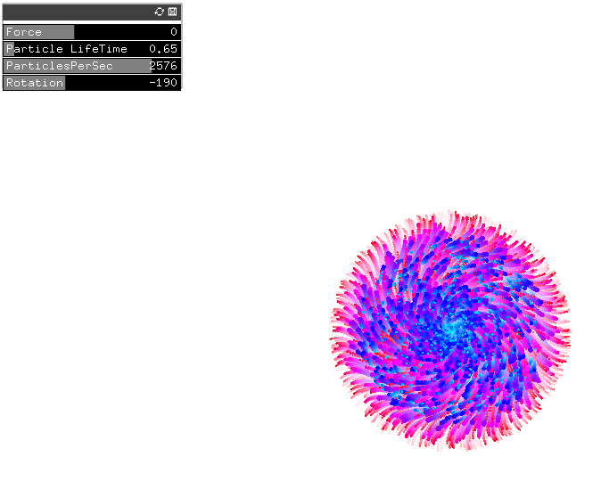

#GUI Test
##Description
This project was created by Christopher Coleman.  The program uses the class particle to generate particles on a screen and uses the class params to assign different parameters to each particle.  As part of my coding assignment added 3 GUIs to the program that allow the user to modify the life and rotation of each particle as well as the rate that the paricles are generated.
##Screen Shot
